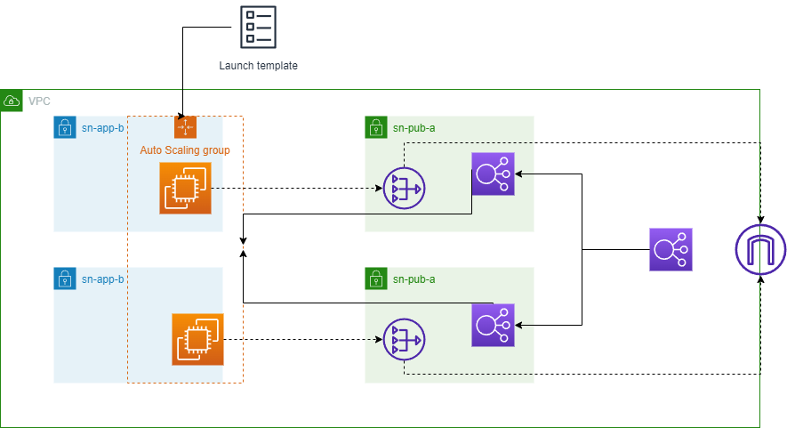

# Custom web app with high availability

This example shows how to create a web app using a custom AMI with a load balancer and an ASG. This deploy is made using CloudFormation. The ASG is configured to use a Launch Template to bootstrap a Flask server. This web app shows a dashboard with the current EC2 instances of the ASG.
This architecture is based on the following principles:

* The ASG will scale out when a EC2 instance is unhealthy.
* The ASG will spanw EC2 instances across multiple availability zones.
* The EC2 instances will be deployed in a private subnet with a custom route table to a NAT gateway.

On the other hand, to achieve a high security level in our environment, we implemented the following principles:

* The EC2 instances have a SG attached to them that only allows HTTP access from the load balancer.
* The load balancer has a SG attached to it that only allows HTPT access.

Possible improvements for the AWS architecture:

* Use Route53 to create a failover DNS record. This record will point to a S3 bucket that contains a static website.
* Configure VPC ACLs to allow only HTTP traffic.

The architecture diagram is shown below:

