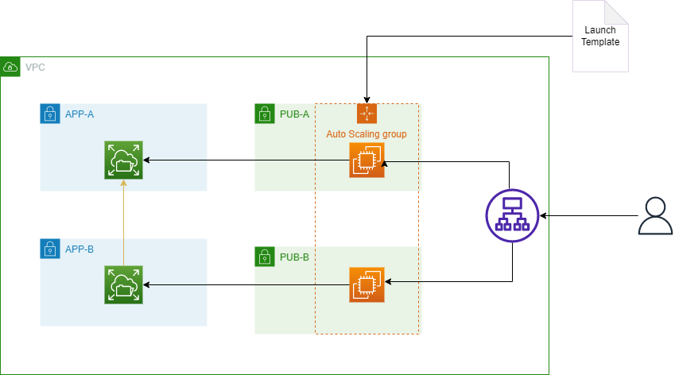

# Web App with HA and EFS

This example shows how to create a web app with high availability and EFS using Terraform. To provide high availability, we use an autoscaling group with a load balancer. This ASG is configured to use a Launch Template to bootstrap the Apache server and mount the EFS file system. The EFS service will be used to store media files.
The high avaialability is achieved based on the following principles:

* The ASG will scale out when a EC2 instance is unhealthy.
* The ASG will spanw EC2 instances across multiple availability zones.
* The load balancer will distribute traffic across the EC2 instances.
* The EFS file system will be mounted on different availability zones.

On the other hand, to achieve a high security level in our environment, we implemented the following principles:

* The EFS file system has a SG attached to it that only allows access to the EC2 instances on port 2049.
* The EC2 instances have a SG attached to them that only allows HTTP access from the load balancer.
* The load balancer has a SG attached to it that only allows HTPT access.

Possible improvements for the AWS architecture:
* Use a custom AMI for the EC2 instances along with the userdata script.
* Use scaling policies to scale out the ASG when the EC2 instances CPU utilization is above a certain threshold.
* VPC ACLs should be configured properly to allow only the needed traffic.

Possible improvements for the Terraform code:
* Use S3 backend type to store the Terraform state.

The architecture diagram is shown below:

